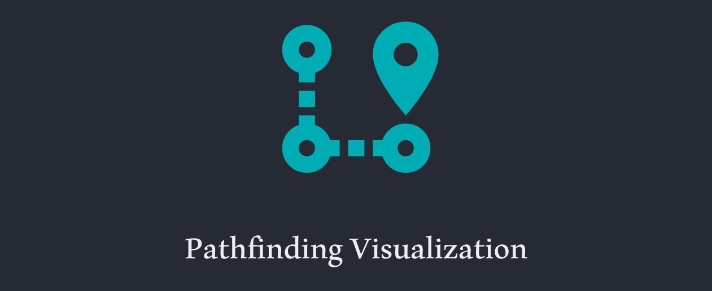
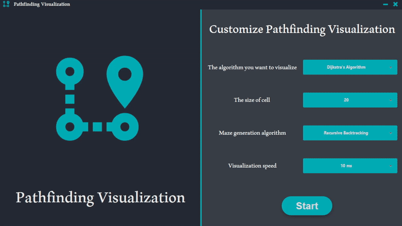
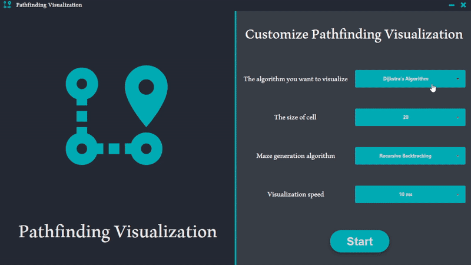

# Pathfinding Visualization

---

  

    
    
    
    
  
	

An application that visualizes many pathfinding and maze generation algorithms. The most important thing that
distinguishes this project from others is the presence of a complete control menu for visualization that helps the user
to control the visualization, for example, running the algorithm step by step. I built this project because I like to
see the visualization of the algorithms and it allows me to deepen my understanding of how these algorithms work more
clearly. I also think that this project could help those who are starting to learn about these algorithms because it
gives them the ability to see how these algorithms work in a less complex and more realistic way.

---

## Contents:

1. [Features](#features)
2. [Installation](#installation)
3. [Frameworks and Libraries](#frameworksandlibraries)

---

## 🎯 Features:

- There are many of maze generation algorithms:
    - Recursive Backtracking
    - Binary Tree algorithm
    - Sidewinder algorithm
    - Prim's Algorithm
    - Kruskal's Algorithm
    - Hunt-and-Kill algorithm
    - Aldous-Broder algorithm

- There are three pathfinding algorithms:
    - Breadth-first Search
    - Depth-first Search
    - Dijkstra's Algorithm

- You can decide which algorithm you want to visualize, the size of the cell, the speed of visualization and whether
  wants to make a maze with a particular algorithm or just an empty grid.

- You can control the visualization, for instance, running the algorithm step by step or continuously and the ability to
  stop the visualization at a specific position or even restart the visualization without having to return to the home
  page.

- You can change the location of the start and end point.

- You can add weight at a specific place and be able to draw walls with the ability to remove these walls and weights.

---

## ⚙️Installation:

- You should have JDK-11 or higher. If you do not have it, you can download it
  from [here](https://www.oracle.com/se/java/technologies/javase-jdk11-downloads.html).
- Download the Pathfinding Visualization jar file from Releases tab or simply by clicking [here](https://github.com/OudayAhmed/Pathfinding-Visualization/releases/download/v1.0/Pathfinding.Visualization.jar).

---

## 💡 Frameworks and Libraries:

- JavaFX
- JFoenix
- Ikonli

---
